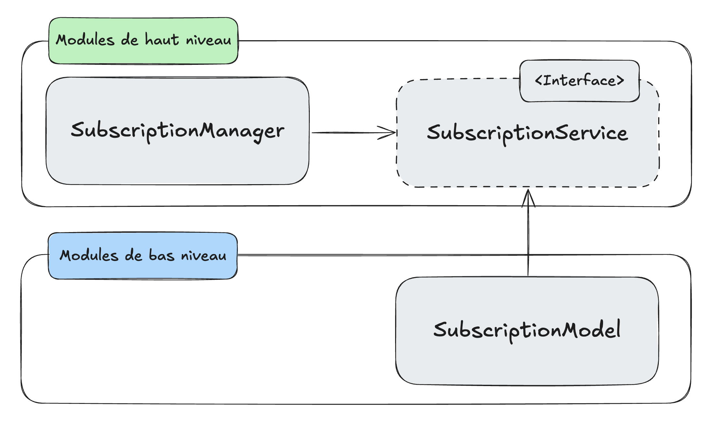

Lorsque l’on construit des applications complexes composées de nombreux services ou modules, certains composants **dépendent** nécessairement d’autres composants. Il est alors important de définir clairement ces dépendances afin d’éviter qu’un changement dans l’un des composants impact le reste du système. C’est ici qu’interviennent (entre autres) l’inversion et l’injection de dépendances. Ces deux concepts sont étroitement liés et par conséquent souvent confondus lorsqu’ils sont abordés lors de conversations et de débats qui tournent autour de l’architecture logicielle. Nous allons donc voir ici à quoi correspond chacun de ces concepts et pourquoi ils sont très importants pour construire des applications maintenables et flexibles.

## Un peu de contexte
Une dépendance dans le cadre du développement logiciel se traduit traditionnellement par le simple import d’un module par un autre module. Dans l’exemple suivant, le gérant d’une salle de sport veut vérifier qu’un client en particulier possède un abonnement actif à sa salle de sport.
``` typescript
import { subscriptionModel } from './database/models'

export class SubscriptionManager {
  isClientStillSubscribed(clientId: string) {
    const subscription = subscriptionModel.findOne(clientId)
    return subscription.expirationDate < new Date() 
  }
}
```
On a donc une classe `SubscriptionManager` chargée de calculer si la souscription du client est toujours active en comparant la date de fin de la souscription et la date du jour. Pour cela le `SubscriptionManager` importe directement le modèle de la base de données et l’utilise pour récupérer la souscription du client. Le `SubscriptionManager` dépend donc directement du modèle de souscription. En continuant d’utiliser cet exemple nous allons voir comment appliquer les principes d’injection et d’inversion de dépendances pour découpler ces deux composants.

## L’injection de dépendances
Nous avons donc terminé de programmer la vérification d’un abonnement et nous décidons (un peu tardivement) d’écrire des tests couvrant cette nouvelle fonctionnalité pour éviter de futures régressions. Nous voilà face à un problème : nous voulons tester que le `SubscriptionManager` calcul correctement l’état de la souscription et nous nous retrouvons pour cela à devoir lancer une base de données et y insérer de la donnée. Le couplage fort entre les deux composants devient flagrant et il est temps de s’en débarrasser en utilisant l’injection de dépendance.
``` typescript
import { SubscriptionModel } from './database/models'

export class SubscriptionManager {
  constructor(private readonly subscriptionModel: SubscriptionModel) {}

  isClientStillSubscribed(clientId: string): boolean {
    const subscription = this.subscriptionModel.findOne(clientId)
    return subscription.expirationDate < new Date() 
  }
}
```
Dans ce nouvel exemple, le `SubscriptionManager` dépend toujours du `SubscriptionModel`. La classe `SubscriptionManager` prend le model en paramètre du constructeur. Ce model sera ensuite **injecté** lorsqu’une nouvelle instance de `SubscriptionManager` sera créée par exemple dans une fonction main appelée au lancement de l’application.
``` typescript
function main() {
  const subscriptionModel = new SubscriptionModel()
  const subscriptionManager = new SubscriptionManager(subscriptionModel)
  // …
}
```
Si nous revenons à notre test, il est maintenant beaucoup plus simple à écrire, plus besoin de lancer l’entièreté de notre application avec une base de données pour lancer notre test. Il nous suffit d’injecter dans `SubscriptionManager` au début de notre test un mock qui respecte le type `SubscriptionModel` et nous voilà capable de tester unitairement le comportement de `SubscriptionManager`.

## Le principe d’inversion de dépendances (DIP)
Le principe d’inversion de dépendances nous permet d’aller encore plus loin dans le découplage de nos deux composants. Dans son livre *Clean Architecture*, Robert C. Martin nous présente les principes fondamentaux regroupés sous le terme SOLID dont le D signifie DIP (Dependency Inversion Principle). Il définit ce principe de la manière suivante : “Le principe DIP nous indique que les systèmes les plus adaptables sont ceux dans lesquels les dépendances de code source ne concernent que des abstractions - pas de concrétions” (traduit de l’anglais par Olivier Engler). Selon ce principe, notre composant `SubscriptionManager` ne peut plus dépendre de la classe `SubscriptionModel`. Ces deux composants doivent dépendre d’une abstraction. On peut illustrer cette nouvelle architecture à l’aide du schéma suivant.

Ici, on voit que nos deux composants ont chacun une dépendance vers un nouveau composant abstrait : l’interface `SubscriptionService`. On assiste donc à une inversion de la dépendance puisque notre composant de haut niveau, le plus stable, qui contient la logique importante de notre application ne dépend plus d’un composant bas niveau, sujet au changement. C’est à l’inverse au composant de bas niveau d’implémenter une interface définie par le haut niveau de l’application.
Si l’on reprend notre exemple précédent, nous avons maintenant nos composants de haut niveau dans lesquelles la dépendances au composant de bas niveau à disparue.
``` typescript
export interface SubscriptionService {
  findOne(clientId: string): Subscription
}

export class SubscriptionManager {
  constructor(private readonly subscriptionService: SubscriptionService) {}

  isClientStillSubscribed(clientId: string): boolean {
    const subscription = this.subscriptionService.findOne(clientId)
    return subscription.expirationDate < new Date()
  }
}
```
Et notre composant de bas niveau qui dépend maintenant de l’abstraction de haut niveau et doit implémenter son interface.
``` typescript
import { SubsriptionService } from '../high-level-components'

export class SubscriptionModel implements SubsriptionService {
  findOne(clientId: string): Subscription {
    // …
  }
}
```
Le principe DIP permet donc à nos composants de haut niveau d’être entièrement découplés de la logique de bas niveau beaucoup plus instable et sujette à des changements.

## Relation entre injection et inversion de dépendance
Dans notre dernier exemple illustrant le principe DIP, nous utilisons l’injection de dépendance pour fournir à notre composant de haut niveau la dépendance concrète dont il a besoin pour fonctionner correctement. Nous avons toujours, comme dans l’exemple précédent, une fonction chargée de l’injection de dépendance.
``` typescript
function main() {
  const subscriptionModel = new SubscriptionModel()
  const subscriptionManager = new SubscriptionManager(subscriptionModel)
  // …
}
```
L’injection de dépendance est donc un outil, une solution pratique, permettant d’appliquer le principe DIP. Ces deux concepts sont étroitement liés mais à distinguer car, comme nous l’avons vu dans [notre deuxième exemple](#linjection-de-dépendances), l’injection de dépendances peut être utilisée sans appliquer le principe DIP. Injecter une dépendance ne garantit donc pas le respect du DIP. Vous noterez, d’ailleurs que notre fonction main, pour fonctionner correctement, doit importer des dépendances concrètes : le `SubscriptionModel` et le `SubscriptionManager`. Ce module contient donc deux dépendances vers des composants concrets ce qui est en violation directe du principe DIP qui nous demande de n’établir des dépendances que vers des abstractions. Néanmoins ces dépendances sont ici tolérées puisqu’il est impossible d’éviter toute violation du principe DIP pour qu’un système fonctionne correctement. L’injection de dépendances permet donc - tout en violant le principe DIP - de respecter au mieux possible le principe DIP en regroupant les dépendances concrètes à un seul endroit.

## Conclusion
L’injection et l’inversion de dépendances sont deux notions complémentaires, à ne pas confondre, qui permettent de réduire le couplage entre composants et de rendre une application plus testable, maintenable et évolutive. L’injection de dépendances offre un moyen pratique de contrôler les interactions entre modules, tandis que le principe DIP pousse plus loin en imposant de baser ces interactions sur des abstractions plutôt que sur des implémentations concrètes. En combinant ces deux approches, on obtient une architecture plus robuste, capable de mieux absorber les changements et de s’adapter aux besoins futurs.
