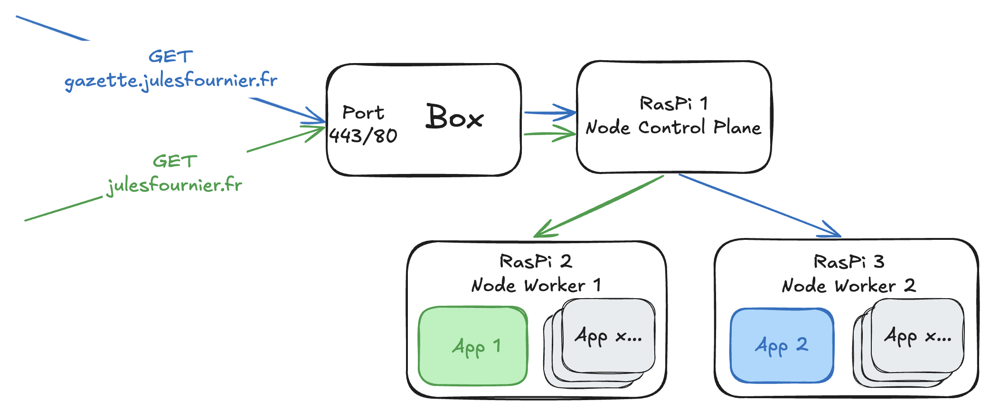

En voulant héberger une n-ième application web, j’ai dans un premier temps pensé à utiliser (comme à chaque fois) une solution tout-en-un pour packager et déployer simplement mon application. Il existe d'innombrables solutions de ce genre : Heroku, Vercel, Fly.io etc… Le souci avec ces solutions c’est qu’elles sont un peu magiques. C’est bien quand on ne veut pas s’embêter, mais c’est moins bien quand on veut comprendre comment les choses fonctionnent. J’ai donc décidé de construire mon propre cloud service provider fait maison pour déployer mes applications.

## Un cluster Kubernetes sur des Raspberry Pi
Pour comomencer, nous avons besoin de hardware, de machines physiques sur lesquelles faire tourner nos applications. La première solution pourrait être de récupérer un vieil ordinateur et de lancer nos applis dessus, mais cette solution n’est pas très scalable et nous voulons faire les choses bien. Nous optons donc pour des Raspberry Pi qui tirent leur avantage dans leur minimalisme. Nous utilisons trois RasPis pour notre besoin actuel, mais le jour où nous aurons besoin d’héberger plus d’applications que ce que notre hardware peut supporter, il suffira d’ajouter un Raspberry Pi à notre flotte pour tenir la charge. Pour orchestrer cette flotte de petits ordinateurs, la solution est toute trouvée : Kubernetes.

Pour installer Kubernetes sur les RasPis, nous allons utiliser [K3s](https://k3s.io/), une distribution Kubernetes légère, simple à installer et optimisée pour des machines comme les RasPis. Par ailleurs, k3s embarque [Traefik](https://docs.k3s.io/networking/networking-services?_highlight=traefik#traefik-ingress-controller), un reverse proxy qui simplifie grandement la gestion des configurations réseau comme le routing à partir de sous-domaines ou le renouvellement de certificats TLS.

Une fois les RasPis allumés et paramétrés, nous les connectons tous à notre box via un switch [PoE](https://fr.wikipedia.org/wiki/Alimentation_%C3%A9lectrique_par_c%C3%A2ble_Ethernet), ce qui permet de les alimenter et de leur fournir un accès réseau via le même câble. Chaque RasPi devient donc un “node” du cluster. K3s permet de les ajouter via une simple commande à jouer sur chaque machine.

Sur le premier RPi, nous lançons la commande suivante pour créer le node “control plane” du cluster.
``` bash
sudo k3s server
```
Le node control plane est le node principal du cluster, c’est lui qui assigne de nouveaux pods aux différents nodes et expose l’apiserver de kube qui nous permet de communiquer avec le cluster.
Pour ajouter les autres nodes au cluster, les nodes “workers”, il suffit simplement de lancer la commande suivante sur chacun d'eux :
``` bash
sudo k3s agent --server https://<ip-du-premier-raspi>:6443 --token <token>
```
Le token est créé par la commande k3s sur le premier RasPi lors de son initialisation.
Nous avons alors un cluster Kubernetes fonctionnel qui tourne sur notre réseau local à la maison. Il ne reste plus qu'à exposer ce cluster au monde extérieur et à déployer des applications dessus.

## Exposition du cluster au monde extérieur
Pour exposer notre cluster au monde extérieur, nous commençons par ouvrir quelques ports sur notre box. Un premier port pour accéder à l’api server kube afin de manipuler des ressources sur le serveur. Nous ouvrons ensuite les ports 443 et 80 pour recevoir les requêtes https et http. Chaque port de la box est dirigé vers le bon port du node control plane pour que le cluster puisse recevoir les requêtes. C’est une manipulation simple à faire sur l’interface de la box mais qui est différente, à peu de choses près, pour chaque marque ou modèle de box. 

Le cluster peut enfin recevoir des requêtes venant de l’extérieur. Pour éviter que les utilisateurs aient à taper une adresse IP dans la barre d’adresse de leur navigateur, nous devons acheter un nom de domaine (*julesfournier.fr*) que nous faisons pointer sur l’adresse IP de notre box. Nous faisons également pointer des sous-domaines vers la même adresse IP pour nos différentes applications. Le cluster se chargera de répartir les requêtes vers les bons process en fonction du sous-domaine qui reçoit la requête.


## On déploie enfin nos applications
Maintenant que le cluster est prêt et exposé au monde extérieur, nous pouvons enfin déployer des applications dessus.

### Une image docker par application
Pour commencer, il faut que chaque application ait un Dockerfile spécifique qui permet de builder une image. Nous pourrons ensuite déployer chaque application tout en nous abstrayant de la complexité liée aux différentes technos utilisées pour les différentes applications. Pour une application web en TypeScript par exemple, nous pouvons ajouter le Dockerfile suivant au repo de l’application :
``` Dockerfile {linenos=true}
FROM node:23-alpine AS build

WORKDIR /app

COPY package.json package-lock.json ./
RUN npm install

COPY . .
RUN npm run build

FROM nginx:alpine

COPY nginx.conf /etc/nginx/conf.d/default.conf
COPY --from=build /app/dist /usr/share/nginx/html

EXPOSE 80

CMD ["nginx", "-g", "daemon off;"]
```
### Une CI qui publie l’image sur le registry Github
Une fois le Dockerfile prêt, chaque repo Github définit un job dans sa CI/CD pour builder et publier l’image sur le registre de Docker. Attention à bien builder notre image pour arm64, les Raspberry Pi étant basés sur cette architecture. Des templates de jobs à réutiliser existent pour faciliter l’écriture de ces Github Actions ([voir la doc](https://github.com/marketplace/actions/build-and-push-docker-images)).

### La configuration K8s des applications
Avec un cluster exposé au monde extérieur et des images docker prêtes à l’emploi, nous pouvons enfin passer à la dernière étape : déployer nos applications sur le cluster. Nous définissons donc pour chaque application plusieurs ressources Kubernetes : un “deployment”, un service de type ClusterIP et un Ingress. D’autres ressources sont déployées comme des “secrets” pour s’authentifier auprès du registry Github pour télécharger les images ou des “middlewares” pour rediriger les requêtes http vers https. Pour chaque application, nous créons aussi un namespace afin d’isoler les différentes ressources spécifiques à une même application. Par exemple, pour ce site de blog, j'ai d'abord créé un namespace `gazette`.
``` bash
kubectl create namespace gazette
```
Nous détaillons ici les trois premières ressources les plus importantes : le déploiement, le service et l’ingress.

Le déploiement définit l’application qui sera lancée, on indique notamment le nom de l’image docker à utiliser, le nombre de replicas à lancer en parallèle et le nom du namespace dans lequel on veut lancer l’application.
```yaml {linenos=true}
apiVersion: apps/v1
kind: Deployment
metadata:
  name: gazette-deploy
  namespace: gazette # on demande de créer la ressource dans le bon namespace
spec:
  replicas: 1 # on ne lance qu’un seul pod
  selector:
    matchLabels:
      app: gazette
  template:
    metadata:
      labels:
        app: gazette
    spec:
      imagePullSecrets:
        - name: regcred # on référence le secret précédemment créé pour s’authentifier auprès du container registry
      containers:
        - name: gazette
          image: ghcr.io/julesfrn/gazette:<tag-de-l-image> # on récupère l’image publiée
```
Une fois que notre déploiement est appliqué au cluster et que nos pods tournent, il faut exposer ces pods au sein du cluster. C’est ce que nous faisons avec notre service ClusterIP.
```yaml {linenos=true}
apiVersion: v1
kind: Service
metadata:
  name: gazette-svc
  namespace: gazette
spec:
  selector:
    # le service doit exposer les pods ciblés par ce filtre, ceux qui ont défini un label “app: gazette” (cf: définition du déploiement)
    app: gazette
  type: ClusterIP
  ports:
    - port: 80 # le service exposera le port 80
      targetPort: 80 # on veut que le trafic qui arrive sur le service soit redirigé vers le port 80 des pods ciblés
```
Enfin, l’ingress nous permet de diriger les requêtes vers le bon service en fonction du domaine/sous-domaine de la requête. Ici, nous définissons un ingress avec une ressource custom fournie par Traefik.
```yaml {linenos=true}
apiVersion: traefik.io/v1alpha1
kind: IngressRoute
metadata:
  name: gazette-ingress
  namespace: gazette
spec:
  entryPoints:
    - web # on accepte les requêtes http
    - websecure # on accepte les requêtes https
  routes:
    - match: Host(`gazette.julesfournier.fr`) # on cible les requêtes concernant le sous-domaine “gazette.”
      kind: Rule
      services:
        - name: gazette-svc # les requêtes sont dirigées vers le port 80 du service “gazette-svc”
          namespace: gazette
          port: 80
      middlewares:
        - name: https-redirect # on utilise le middleware défini précédemment pour rediriger toutes les requêtes vers de l’https.
          namespace: gazette
  tls: # on utilise letsencrypt pour renouveler les certificats TLS de notre application
    certResolver: letsencrypt
    domains:
      - main: julesfournier.fr
        sans:
          - gazette.julesfournier.fr
```

Une fois ces ressources appliquées à notre cluster, notre application est enfin utilisable par de vrais utilisateurs.

## Pistes d’amélioration
Nous avons donc un cluster Kubernetes entièrement fonctionnel mais il y a encore une grande marge d’amélioration. Il y a notamment beaucoup de code factorisable dans les définitions de ressources kube qui se ressemblent beaucoup pour chaque application.

Nous pourrions aussi, grâce à Ansible, automatiser la mise à jour des versions d’images pour leur déploiement sur le cluster lors des futures mises à jour des applications.

## Conclusion
Ce setup pourra donc continuer à évoluer en fonction des différentes douleurs que nous pourrons rencontrer.
J’espère que cet article vous aura donné envie de vous lancer dans la création de votre propre cluster Kubernetes à la maison. C’est un projet amusant et enrichissant qui permet de mieux comprendre comment fonctionnent les applications modernes et les infrastructures cloud.
